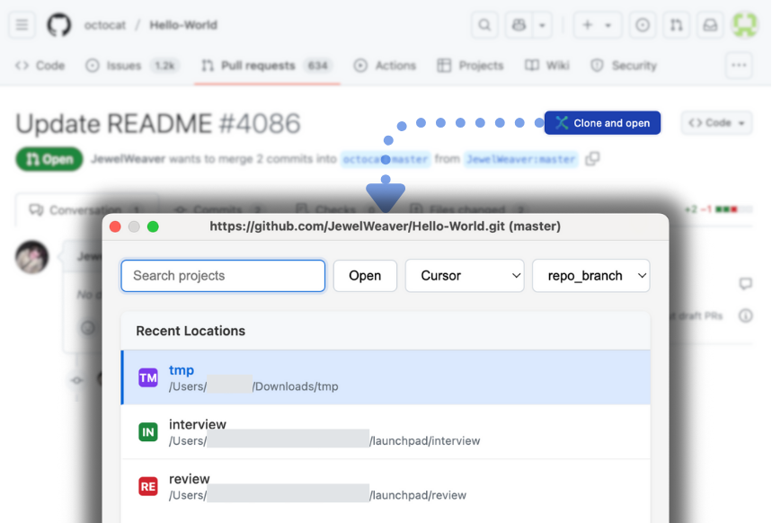

# Quick Git Clone

> Your one-click tool for cloning any GitHub pull request and jumping straight into the code.

Stop wasting time with the tedious clone-and-branch routine. **Quick Git Clone** adds a "Clone & Open" button to **any pull request** on GitHub, letting you jump straight into the code with a single click.

It’s the seamless, high-speed workflow you've always wanted.

## How It Works

1.  Find a pull request you want to review or test.
2.  Click the **Clone & Open** button.
3.  Choose where to save it.

That's it. The tool handles the rest: cloning the repository, checking out the PR branch, and opening it directly in your favorite editor.

## Features

-   **Works on Any Pull Request**: From any repository, public or private.
-   **Jump Directly into Code**: No more command-line hassle. Go from browser to editor in seconds.
-   **Automatic Branching**: Always checks out the correct PR branch for you.
-   **Broad Editor Support**: Works with VS Code, Cursor, WebStorm, and Sublime Text.
-   **GitHub Enterprise Ready**: Connects to both github.com and enterprise instances.
-   **Native macOS Feel**: A lightweight system tray app with native notifications.

## Installation

Quick Git Clone consists of two parts: a macOS app and a Chrome extension. You'll need both.

### 1. macOS App

This app does all the heavy lifting in the background.

1.  **[Download the latest release](https://github.com/quick-git-clone/quick-git-clone/releases)**.
2.  Copy **Quick Git Clone.app** to your **/Applications** folder.
3.  Launch it once to get everything set up.

### 2. Chrome Extension

This extension adds the "Clone & Open" button to GitHub.

1.  **Install from the Chrome Web Store** (link coming soon!).
2.  Or, load it manually: download the source and load the `chrome-extension/dist` folder as an unpacked extension in `chrome://extensions/`.

## Requirements

-   macOS 10.15 or later
-   Git installed on your system
-   Google Chrome

---

Want to contribute or have questions? Check out our [**Contributing Guide**](CONTRIBUTING.md).

Licensed under the MIT License.
